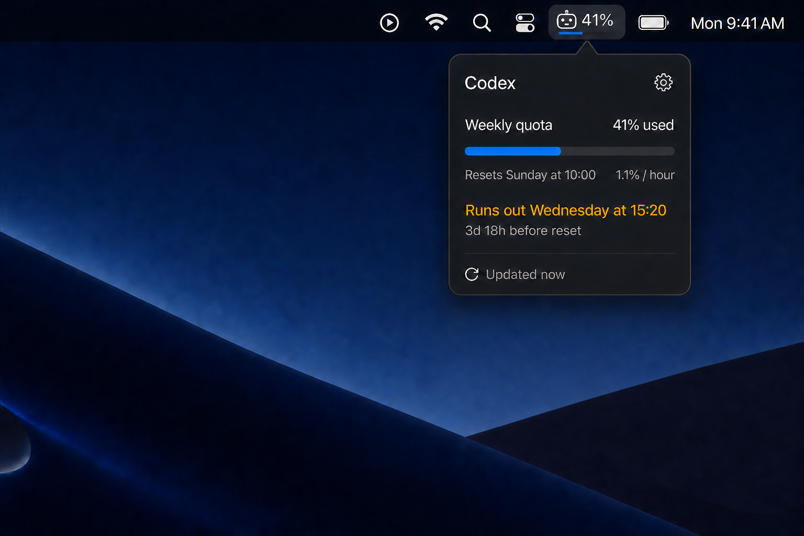

# AgentQuota

AgentQuota is a native, dependency-free SwiftUI menu-bar app for macOS 26. It shows the lowest remaining percentage across the active Codex subscription quota windows and reads that data through the installed Codex CLI's local app-server protocol.



## Requirements

- macOS 26
- Xcode 26
- A current Codex CLI installation
- An authenticated Codex account

AgentQuota is intentionally a developer build. It uses local/ad-hoc signing, is not sandboxed, and has no notarized public release pipeline in v1.

## Build and run

1. Install Codex CLI and sign in:

   ```sh
   codex login
   ```

2. Open `AgentQuota.xcodeproj` in Xcode 26.
3. Select the **AgentQuota** scheme and **My Mac** destination.
4. Choose **Run**.

The app appears only in the menu bar. It intentionally has no Dock icon or conventional application window.

You can also build and test from Terminal:

```sh
xcodebuild -project AgentQuota.xcodeproj -scheme AgentQuota -destination 'platform=macOS' build
xcodebuild -project AgentQuota.xcodeproj -scheme AgentQuota -destination 'platform=macOS' test
```

## Codex discovery

AgentQuota searches the inherited `PATH` first, followed by these locations:

- `~/.superset/bin/codex`
- `~/.local/bin/codex`
- `/opt/homebrew/bin/codex`
- `/usr/local/bin/codex`

The discovered file must exist and be executable. AgentQuota does not provide a binary picker.

## How it works

AgentQuota runs `codex app-server --stdio` as a managed child process. It initializes the newline-delimited JSON-RPC connection, requests `account/rateLimits/read`, and refreshes when Codex emits `account/rateLimits/updated`. It also polls every 60 seconds, refreshes when the menu opens, and supports manual refresh.

Quota and authentication data are never persisted. The current snapshot remains in memory during transient failures and is marked stale after two minutes. Quitting AgentQuota terminates the child app-server process.

## Troubleshooting

### Codex CLI was not found

Confirm `codex --version` works in Terminal and that the binary is executable in one of the discovery paths above. If Xcode was opened before your shell configuration changed, quit and reopen Xcode, then choose **Retry** in AgentQuota.

### Sign-in required

Run `codex login` in Terminal and complete authentication, then choose **Retry**.

### Quota reporting is unsupported

Update the Codex CLI and choose **Retry**. The app-server protocol is version-sensitive, so AgentQuota detects unsupported methods instead of relying on a hard-coded CLI version.

### Network or app-server failure

AgentQuota retains the last successful in-memory snapshot and reconnects after 1, 2, 5, then 30 seconds. Manual **Refresh** or **Retry** starts another attempt immediately.
