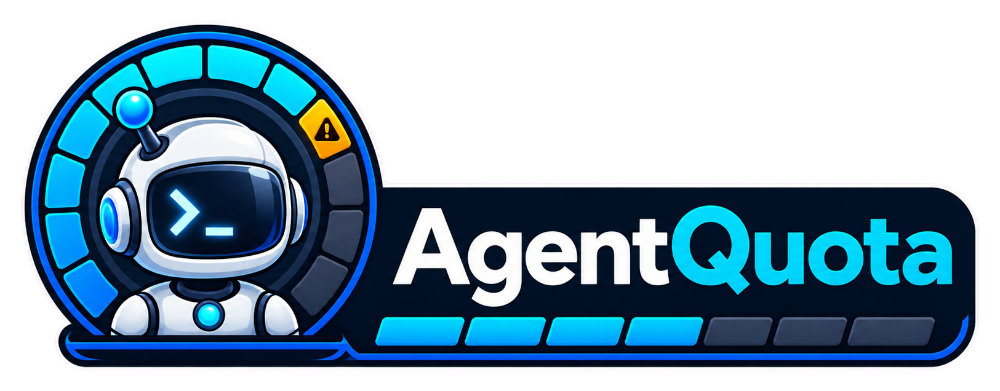
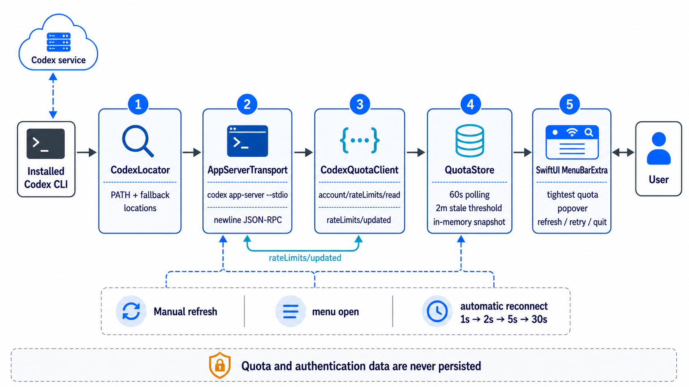

<p align="center">
  
  <br />
  <strong>🤖 Know your Codex quota at a glance 📊</strong>
</p>

AgentQuota is a native macOS menu-bar app for developers who use Codex. It keeps the tightest active subscription quota visible and opens a compact breakdown of every available quota window, reset time, run-out forecast, and connection state.

The app reads quota data through the installed Codex CLI's local app-server protocol. It has no third-party dependencies and does not persist quota or authentication data.

## Install

Requires macOS 26, Xcode 26, and a current Codex CLI installation.

```bash
git clone https://github.com/tsilva/agentquota.git
cd agentquota
codex login
open AgentQuota.xcodeproj
```

In Xcode, select the **AgentQuota** scheme and **My Mac** destination, then choose **Run**. AgentQuota appears in the menu bar rather than the Dock.

## Commands

Run these commands from the repository root:

```bash
xcodebuild -project AgentQuota.xcodeproj -scheme AgentQuota -destination 'platform=macOS' build  # build the app
xcodebuild -project AgentQuota.xcodeproj -scheme AgentQuota -destination 'platform=macOS' test   # run the tests
```

## Notes

- On first launch, AgentQuota checks standard Codex installation paths before `PATH` and wrapper locations, then saves the selected executable in `~/.agentquota/config.json`.
- Use **Settings…** in the menu to select a different Codex executable. AgentQuota keeps using the saved path on later launches.
- It refreshes when the menu opens, when Codex reports a quota update, every 60 seconds, or when you refresh manually.
- The “Updated” age tracks the last observed quota-value change; successful checks that return identical values do not reset it.
- Each quota row estimates whether and when it will run out using the average usage pace since that active window began. Forecasts use only the current snapshot and are not persisted.
- The last successful snapshot stays in memory during transient failures and becomes stale after two minutes.
- Reconnect attempts back off through 1, 2, 5, and 30 seconds.
- This is an unsandboxed, locally signed developer build because it must run the local Codex executable. There is no notarized public release pipeline.

## Troubleshooting

- **Codex CLI not found:** confirm `codex --version` works, then reopen Xcode and choose **Retry**.
- **Configured Codex unavailable:** open **Settings…**, then choose the current Codex executable.
- **Sign-in required:** run `codex login`, finish authentication, and choose **Retry**.
- **Quota reporting unsupported:** update the Codex CLI and choose **Retry**.
- **App-server or network failure:** use **Refresh** or **Retry**; AgentQuota keeps the latest in-memory snapshot while reconnecting.

## Architecture



## License

[MIT](LICENSE)
