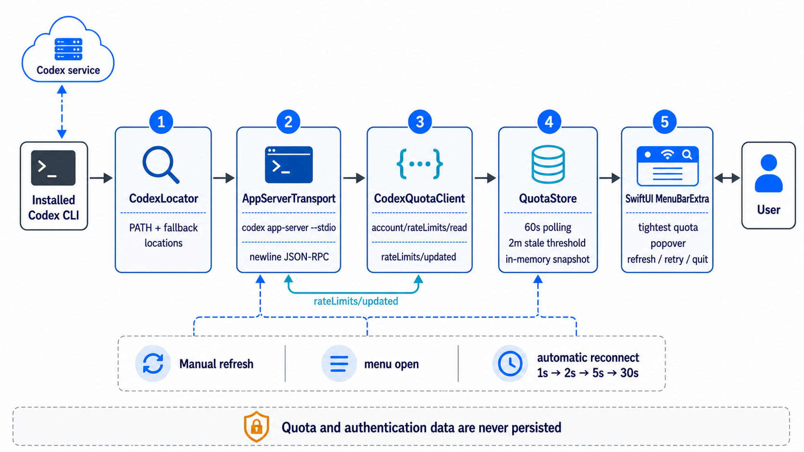

<p align="center">
  
  <br />
  <!-- repo-tagline:start -->
  <strong>🤖 Know your Codex quota at a glance 📊</strong>
  <!-- repo-tagline:end -->
</p>

AgentQuota is a native macOS menu-bar app for developers who use Codex. It keeps the tightest active subscription quota visible and opens a compact breakdown of every available quota window, reset time, run-out forecast, and connection state.

The app reads quota data through the installed Codex CLI's local app-server protocol. It has no third-party dependencies and does not persist quota or authentication data.

## Install

Requires macOS 26, Xcode 26, and a current Codex CLI installation.

```bash
git clone https://github.com/tsilva/agentquota.git
cd agentquota
codex login
open AgentQuota.xcodeproj
```

In Xcode, select the **AgentQuota** scheme and **My Mac** destination, then choose **Run**. AgentQuota appears in the menu bar rather than the Dock.

## Commands

Run these commands from the repository root:

```bash
xcodebuild -project AgentQuota.xcodeproj -scheme AgentQuota -destination 'platform=macOS' build  # build the app
xcodebuild -project AgentQuota.xcodeproj -scheme AgentQuota -destination 'platform=macOS' test   # run the tests
```

## Releases

Release builds run in GitHub Actions on macOS 26 with Xcode 26.6. From a clean,
synchronized `main` checkout with authenticated `gh`, run:

```bash
.agents/skills/build-release/scripts/build-release.zsh            # publish the next app release
.agents/skills/build-release/scripts/build-release.zsh --dry-run  # validate in Actions without publishing
```

The workflow selects the version from Git history, tests and packages the app,
and publishes the validated DMG and SHA-256 checksum to
[GitHub Releases](https://github.com/tsilva/agentquota/releases). The local command
only dispatches the workflow; it does not build the app. Documentation-, skill-,
and test-only changes do not create a new app release.

## Notes

- On first launch, AgentQuota checks standard Codex installation paths before `PATH` and wrapper locations, then saves the selected executable in `~/.agentquota/config.json`.
- Use **Settings…** in the menu to select a different Codex executable. AgentQuota keeps using the saved path on later launches.
- It refreshes when the menu opens, when Codex reports a quota update, every 60 seconds, or when you refresh manually.
- The “Updated” age tracks the last observed quota-value change; successful checks that return identical values do not reset it.
- Each quota row shows the percentage remaining now and one forecast outcome at reset. The bar combines usage so far (solid blue), expected additional usage (hatched blue), unused quota, and projected demand over quota (hatched red). Plain labels distinguish “Used so far”, “Expected use”, and the fixed quota limit. Detailed percentages and the local reset date are available on hover.
- Forecasts use average usage since that active window began. The summary shows how much is likely to remain unused or exceed the quota; projected leftovers below 5% retain a quiet on-track state. The bar reserves space through 125% of quota, with a continuation arrow for larger forecasts. Exhausted quota and windows without valid timing show actual usage without an extrapolated forecast.
- The menu bar shows the tightest window’s remaining percentage beside a miniature usage bar with the same solid blue, striped forecast, red overflow, and fixed quota limit as the popover. Its tooltip explains the marks and reports the highest-priority forecast across all windows. Forecast segments are hidden while disconnected; stale data shows a clock beside the cached percentage. Forecasts use only the current snapshot and are not persisted.
- The last successful snapshot stays in memory during transient failures and becomes stale after two minutes.
- Reconnect attempts back off through 1, 2, 5, and 30 seconds.
- This is an unsandboxed, locally signed developer build because it must run the local Codex executable. There is no notarized public release pipeline.

## Troubleshooting

- **Codex CLI not found:** confirm `codex --version` works, then reopen Xcode and choose **Retry**.
- **Configured Codex unavailable:** open **Settings…**, then choose the current Codex executable.
- **Sign-in required:** run `codex login`, finish authentication, and choose **Retry**.
- **Quota reporting unsupported:** update the Codex CLI and choose **Retry**.
- **App-server or network failure:** use **Refresh** or **Retry**; AgentQuota keeps the latest in-memory snapshot while reconnecting.

## Architecture



## License

[MIT](LICENSE)
